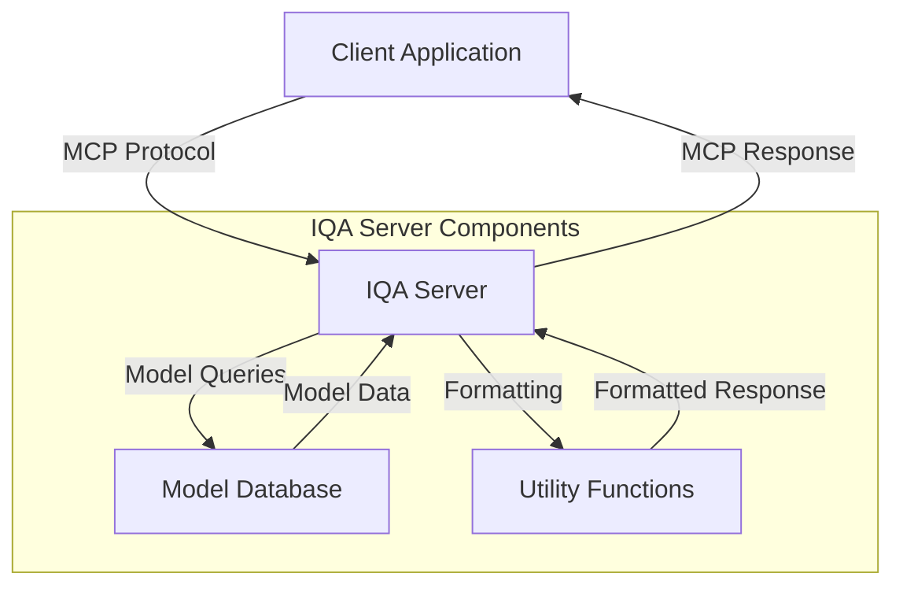
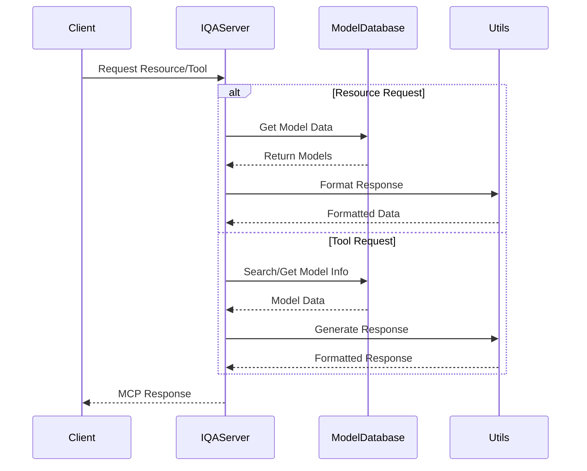
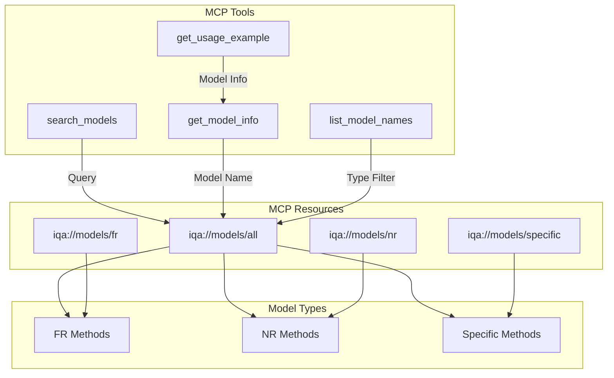
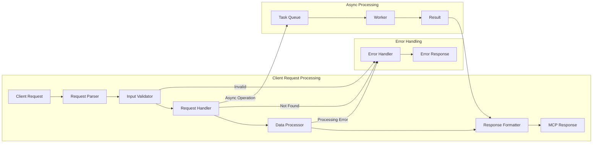

# IQA MCP Server Architecture

This document describes the architecture and design decisions of the IQA MCP Server, which provides access to Image Quality Assessment (IQA) model information through the Model Context Protocol.

## System Architecture Diagrams

### Component Interaction


### Data Flow


### Class Structure
```mermaid
classDiagram
    class IQAServer {
        +Server server
        +format_model_info()
        +generate_model_comparison()
        +format_search_results()
        +generate_usage_example()
        -_setup_handlers()
        +run()
    }
    
    class IQAModelDatabase {
        +get_all_models()
        +get_fr_models()
        +get_nr_models()
        +get_specific_models()
        +search_models()
        +get_model_info()
        +list_model_names()
    }
    
    class Utils {
        +format_model_info()
        +generate_model_comparison()
        +format_search_results()
        +generate_usage_example()
    }
    
    IQAServer --> IQAModelDatabase : uses
    IQAServer --> Utils : uses

## Overview

The IQA MCP Server is designed with a modular architecture, separating concerns into distinct components for better maintainability, testability, and extensibility. The server provides information about various IQA models, including Full Reference (FR), No Reference (NR), and task-specific methods.

## Directory Structure

```
MCP-IQA-Server/
├── iqa_server/                   # Main package directory
│   ├── __init__.py              # Package initialization and exports
│   ├── constants.py             # Configuration and constant values
│   ├── models.py                # Model database and related functionality
│   ├── server.py                # MCP server implementation
│   └── utils.py                 # Utility functions
├── tests/                       # Test directory
│   └── test_iqa_server.py      # Test suite
├── examples/                    # Example code directory
│   └── example_client.py       # Example client implementation
├── iqa_server.py               # Main entry point
├── requirements.txt            # Project dependencies
├── pyproject.toml             # Project configuration
├── LICENSE                    # Project license
└── README.md                 # Project documentation
```

## Core Components

### 1. Model Database (`models.py`)

The `IQAModelDatabase` class manages the database of IQA models and their metadata. It provides:

- Model data storage and retrieval
- Search functionality
- Model information lookup
- Type-specific model filtering

```python
class IQAModelDatabase:
    def get_all_models(self) -> Dict[str, Any]
    def get_fr_models(self) -> Dict[str, Any]
    def get_nr_models(self) -> Dict[str, Any]
    def get_specific_models(self) -> Dict[str, Any]
    def search_models(self, query: str, model_type: str = "all") -> List[Dict[str, Any]]
    def get_model_info(self, model_name: str) -> Dict[str, Any]
    def list_model_names(self, model_type: str = "all") -> List[str]
```

### 2. MCP Server (`server.py`)

The `IQAServer` class implements the Model Context Protocol server. It handles:

- Resource management
- Tool registration and execution
- Request handling
- Response formatting

Key features:
- Resource listing and retrieval
- Model search functionality
- Model information retrieval
- Usage example generation

### 3. Utilities (`utils.py`)

Utility functions for formatting and generating responses:

- `format_model_info()`: Formats model information into readable text
- `generate_model_comparison()`: Compares two models
- `format_search_results()`: Formats search results
- `generate_usage_example()`: Generates code examples

### 4. Constants (`constants.py`)

Centralizes configuration and constant values:

- Server configuration
- Resource URIs
- Model types and categories
- Database keys
- Model information keys

## Protocol Implementation

### Resource and Tool Interactions


### Resources

The server exposes the following MCP resources:

1. `iqa://models/all` - All IQA models
2. `iqa://models/fr` - Full Reference models
3. `iqa://models/nr` - No Reference models
4. `iqa://models/specific` - Task-specific models

### Tools

Available MCP tools:

1. `search_models`
   - Search for models by name, type, or category
   - Supports filtering by model type

2. `get_model_info`
   - Retrieve detailed information about a specific model
   - Returns model metadata and capabilities

3. `list_model_names`
   - List available model names
   - Supports filtering by model type

4. `get_usage_example`
   - Generate code examples for model usage
   - Provides basic implementation patterns

## Design Principles

1. **Modularity**
   - Clear separation of concerns
   - Independent components
   - Easy to extend or modify

2. **Type Safety**
   - Comprehensive type hints
   - Clear interface definitions
   - Runtime type checking

3. **Error Handling**
   - Graceful error handling
   - Clear error messages
   - Proper exception propagation

4. **Documentation**
   - Detailed docstrings
   - Clear code comments
   - Comprehensive examples

## Request Processing Pipeline



## Testing

The test suite (`test_iqa_server.py`) includes:

- Unit tests for each component
- Integration tests for MCP functionality
- Comprehensive coverage of API endpoints
- Edge case handling validation

## Future Considerations

1. **Extensibility**
   - Easy addition of new model types
   - Support for custom metrics
   - Plugin system for extensions

2. **Performance**
   - Caching mechanisms
   - Optimized search algorithms
   - Batch processing support

3. **Integration**
   - Support for additional protocols
   - Cloud service integration
   - Container deployment

## Dependencies

Core dependencies:
- `mcp-python`: Model Context Protocol implementation
- `pyiqa`: IQA model implementations
- `pydantic`: Data validation
- `typing-extensions`: Enhanced type hints

Development dependencies:
- `pytest`: Testing framework
- `pytest-asyncio`: Async test support
- `pytest-cov`: Coverage reporting
